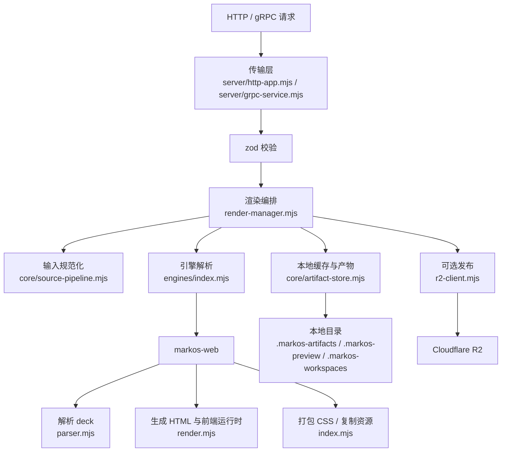

# MarkOS 架构说明

## 1. 项目定位

这个仓库当前是一个 Markdown -> Slides 工具链，既保留托管服务能力，也开始提供面向个人用户的本地工作流，目标很明确：

- 对个人用户提供 `markos build` / `markos dev` 这类本地作者入口。
- 对外继续保留现有的 HTTP / gRPC 服务边界，方便上游兼容。
- 内部不再依赖 Slidev 运行时，而是使用自建的 `markos-web` 渲染引擎。
- 当前只产出 `web` 形式的静态幻灯片站点。
- 同时支持短生命周期的临时预览，以及可复用的命名预览站点。
- 可选地把构建结果发布到 Cloudflare R2。

从代码职责上，这个项目可以分成六层：

- 传输层：HTTP / gRPC 入口与协议适配
- 编排层：预览、渲染、缓存命中、发布流程
- 规范化层：把输入 markdown / source files 变成统一文件树
- 存储层：本地产物、缓存元数据、清理任务
- 引擎层：解析 deck、生成静态 SPA
- 发布层：上传到 R2、构造公网访问地址

## 2. 总体运行图

## 3. 目录与模块职责

### 3.1 入口层

- `src/index.mjs`
  包级根入口。当前把默认公开 API 收敛到核心构建层，适合作为未来开源 `core` 包的主入口。

- `packages/core`
  workspace 包装层。当前直接转发 `src/core` 能力，用来固定未来独立发布时的包边界。

- `packages/cli`
  workspace 包装层。当前直接转发 `src/cli` 能力，并提供一个独立的 CLI bin 壳子。

- `packages/server`
  workspace 包装层。当前直接转发 `src/server` 能力，用来固定未来服务端子包边界。

- `src/cli/index.mjs`
  包级 CLI 入口。对外暴露 `runCli()` 和 `parseCliArgs()`，同时被 `src/cli.mjs` 这个可执行包装层复用。

- `src/server/index.mjs`
  包级 server 入口。统一导出 HTTP 启动器、gRPC 启动器和兼容 helper，便于后续拆成单独包或 monorepo 子包。

- `src/server.mjs`
  兼容入口。保留原有启动路径，直接执行时会转调 `src/server/http-app.mjs` 里的 `startServer()`。

- `src/grpc-server.mjs`
  兼容入口。保留原有 import 路径，对外继续导出 gRPC 相关 helper 和 `startGrpcServer()`。

- `src/server/http-app.mjs`
  HTTP 适配层的实际实现。负责 Express 初始化、JSON body 解析、CORS、HTTP 路由、本地静态文件分发、启动清理任务，以及拉起 gRPC 服务。

- `src/server/grpc-service.mjs`
  gRPC 适配层的实际实现。负责加载 `src/slidev_service.proto`、解析 gRPC 请求、把 proto 字段映射为内部结构，并把结果再格式化回 gRPC 响应。

- `src/load-env.mjs`
  极简环境变量加载器。按顺序加载 `.env` 和 `.env.local`，但不会覆盖进程启动时就已经存在的环境变量。

### 3.2 编排层

- `src/render-manager.mjs`
  整个构建链路的核心编排器。负责：
  - 选择渲染引擎
  - 规范化输入文件
  - 计算缓存 key
  - 创建工作目录
  - 调用引擎构建
  - 写入缓存元数据
  - 关联发布结果缓存

- `src/preview-manager.mjs`
  专门处理短生命周期预览会话。会把 session 保存在内存中，只有内容变化时才重建，并在超时后自动清理会话目录。

### 3.3 核心基础模块

- `src/core/source-pipeline.mjs`
  输入规范化层。把 `content` 或 `source.files` 统一整理成引擎可消费的文件树，同时处理标题注入、旧版 `css:` frontmatter 兼容、单文件模式的资源清洗等逻辑。

- `src/core/artifact-store.mjs`
  文件系统存储层。负责本地产物目录、缓存元数据目录、manifest 写入，以及过期缓存和过期产物的清理。

- `src/core/path-utils.mjs`
  路径与 ID 规范化工具。核心作用是防止路径穿越，同时强制 built preview 的 `basePath` 必须是 `/p/{previewId}/`。

- `src/config/index.mjs`
  共享运行时配置层。负责集中管理 CLI / server / core 共用的默认值和配置解析逻辑，例如：
  - 默认入口文件
  - 本地 dev host / port
  - HTTP / gRPC 默认端口
  - session TTL
  - 本地缓存清理周期
  - authoring / hosted 模式的默认选择

### 3.4 引擎层

- `src/engines/index.mjs`
  渲染引擎注册表。目前只支持 `markos-web`。

- `src/engines/markos-web/parser.mjs`
  负责把 markdown deck 解析成结构化 slide 数据，支持顶部 frontmatter、按 `---` 分页、每页 frontmatter、视口比例和画布宽度等信息。

- `src/engines/markos-web/render.mjs`
  把解析后的 slide 数据转换成 HTML 片段，并注入浏览器端运行时。包括：
  - slides 视图
  - presenter 视图
  - overview 视图
  - export 视图
  - 键盘翻页
  - 跨标签同步

- `src/engines/markos-web/index.mjs`
  引擎装配层。负责读取入口文件、选择 CSS 来源、递归打平本地 `@import`、复制静态资源、写出最终的 `index.html`。

- `src/engines/markos-web/styles.mjs`
  内建样式表，主要提供应用外壳、overview、presenter 等 UI 样式。

### 3.5 发布与部署辅助

- `src/r2-client.mjs`
  Cloudflare R2 适配层。支持目录上传、文件上传、远端对象枚举、增量复用静态资源、删除过期远端对象、生成公网 URL。

- `docs/worker.js`
  一个示例性的 Worker，用于从对象存储中读取已发布的 preview site。

- `docs/deploy/`
  部署示例，包括 Docker Compose、Nginx 配置和版本文件。

### 3.6 本地辅助脚本与测试

- `scripts/preview-local-file.mjs`
  把本地 markdown 文件发送到运行中的服务，便于本地联调。

- `scripts/watch-preview-local-file.mjs`
  监听本地文件变化并自动重新触发预览构建。

- `scripts/check-fixtures.mjs`
  扫描 `test/fixtures/markdown`，检查单文件模式下不允许残留的本地资源引用和自定义组件标签。

- `scripts/check-examples.mjs`
  实际构建 `examples/basic` 和 `examples/project`，用来保证 README 和 examples 中的上手路径持续可运行。

- `test/*.test.mjs`
  覆盖渲染引擎、输入规范化、预览会话、引擎选择、gRPC 兼容性等核心行为。

## 4. 启动流程

当执行 `node src/server.mjs` 时，整体启动流程如下：

1. `src/server.mjs` 作为兼容入口，转调 `src/server/http-app.mjs`。
2. `src/load-env.mjs` 先加载 `.env`，再加载 `.env.local`。
3. 初始化 Express：
   - `trust proxy = true`
   - `cors({ origin: true })`
   - `express.json({ limit: MARKOS_BODY_LIMIT || "20mb" })`
4. 创建本地产物目录。
5. 启动时先做一次过期产物清理。
6. 启动定时清理任务。
7. 通过 `src/server/grpc-service.mjs` 初始化 gRPC 服务。
8. HTTP 服务监听 `PORT`，默认 `3210`。

因此这个进程本质上是一个“HTTP + gRPC 双入口”的单服务进程。

## 4.1 包入口设计

为了同时支撑“内部服务端适配层”和“未来面向个人用户的开源工具”，当前仓库已经开始把公开入口收敛成三类：

- `package root -> src/index.mjs`
  默认面向核心构建能力，对应未来的 `core` 心智模型。

- `package subpath ./cli -> src/cli/index.mjs`
  面向个人工具入口，对应 `markos build` / `markos dev` 这类本地工作流。

- `package subpath ./server -> src/server/index.mjs`
  面向托管服务入口，对应 HTTP / gRPC 适配层。

这样做的目的不是现在就发布多个 npm 包，而是先把“对外稳定接口”和“内部实现细节”分开。

这一步现在又往前走了一层：
- `src/*` 仍然是主要实现位置
- `packages/*` 已经作为 workspace 包装层存在
- 所以未来无论继续单包，还是演进到多包发布，边界都已经被提前固定

## 5. 传输层设计

### 5.1 HTTP 路由

`src/server/http-app.mjs` 当前暴露这些路由，`src/server.mjs` 只是兼容包装：

- `GET /healthz`
- `POST /api/preview/session`
- `POST /api/render`
- `POST /api/previews/build`
- `GET /preview/:sessionId/*`
- `GET /p/:previewId/*`
- `GET /artifacts/*`

这些写接口的共同模式是：

- 先用 `zod` 校验请求体
- 再调用 `render-manager.mjs` 或 `preview-manager.mjs`
- 按需执行 R2 发布
- 最后统一组装 JSON 响应

### 5.2 gRPC 方法

`src/server/grpc-service.mjs` 暴露两个 gRPC 方法，`src/grpc-server.mjs` 继续对外转发：

- `BuildPreview`
- `RenderArtifact`

gRPC 层本身尽量做薄，只负责：

- proto 字段转内部字段
- render format 枚举值映射
- `binary_content` 转 base64
- 和 HTTP 层保持一致的校验语义
- 返回上游系统期望的 URL 字段

## 6. 三条核心业务链路

### 6.1 临时预览会话：`POST /api/preview/session`

这是一个短生命周期、偏编辑态的预览流程，适合快速看当前文档的渲染结果。

适用场景：

- 编辑中的 markdown 文档快速预览
- 不需要持久化 previewId
- 更像“会话预览”，而不是“发布预览站点”

处理流程：

1. 请求进入 HTTP 入口 `src/server/http-app.mjs`
2. `previewSessionRequestSchema` 校验 `{ title, content, optional identity fields }`
3. `preview-manager.mjs` 里的 `ensurePreviewSession()` 根据标题、内容或业务 identity 生成稳定的 `sessionId`
4. 渲染结果输出到 `.markos-preview/{sessionId}`
5. 中间工作目录使用 `.markos-preview-work/{sessionId}`，构建完成后会删除
6. 返回：
   - `sessionId`
   - `slidesUrl`
   - `overviewUrl`
   - `presenterUrl`

这个模式的关键特征：

- session 只保存在进程内存的 `Map` 里
- 产物只保存在本地
- 超时由 `MARKOS_SESSION_TTL_MS` 控制
- 访问路径是 `/preview/{sessionId}/...`
- 示例 Nginx 配置会显式禁止公网访问 `/preview/`

也就是说，这条链路优先服务“低成本预览”，不追求跨实例共享和重启恢复。

### 6.2 命名预览站点：`POST /api/previews/build`

这是可复用 preview 站点的构建流程，目标是得到稳定的 `/p/{previewId}/` 地址。

适用场景：

- 需要稳定 previewId
- 需要缓存命中
- 需要可选发布到对象存储

处理流程：

1. 请求进入 HTTP 入口 `src/server/http-app.mjs`
2. 校验参数，重点包括：
   - `previewId` 必须满足命名规则
   - `basePath` 必须等于 `/p/{previewId}/`
   - 输入必须包含 `content` 或 `source.files`
3. `render-manager.mjs` 调用 `buildPreviewSite()`
4. `source-pipeline.mjs` 把输入整理为统一 source files
5. 根据以下信息生成 preview source hash：
   - 缓存版本号
   - `basePath`
   - `sourceEntry`
   - 规范化后的 source files
6. 检查本地 preview cache 是否命中
7. 如果未命中：
   - 在 `.markos-workspaces/{buildId}` 中写入临时工作文件
   - 在 `.markos-artifacts/previews/{previewId}` 中写入最终静态站点
   - 在产物目录中写入 `manifest.json`
   - 在 `.markos-artifacts/preview-cache/{previewId}.json` 中写入缓存元数据
8. 如果请求要求 `publish`，则调用 `r2-client.mjs` 上传目录，并把发布结果回写到 preview cache 文件
9. 返回：
   - `previewUrl`
   - `publishedPreviewUrl`
   - `manifest`
   - `cacheHit`
   - `timings`

这个流程的重点是：`previewId` 代表的是一个稳定命名空间，而不是一次性 job。

### 6.3 通用渲染产物：`POST /api/render`

这个接口负责产出“渲染产物”，当前虽然 schema 接受 `web | pdf | pptx`，但实际上只允许 `web`。

处理流程：

1. 请求进入 `src/server/http-app.mjs` 或 `src/server/grpc-service.mjs`
2. 参数校验后，非 `web` 格式会被明确拒绝
3. `render-manager.mjs` 调用 `renderArtifact()`
4. `source-pipeline.mjs` 规范化 source files
5. 根据这些信息生成 render cache key：
   - 缓存版本号
   - 输出格式
   - 输出文件名
   - `sourceEntry`
   - 规范化后的 source files
6. 检查 render cache 是否命中
7. 如果未命中：
   - 在 `.markos-workspaces/{jobId}` 中写工作目录
   - 在 `.markos-artifacts/renders/{jobId}/web` 中写最终输出
   - 在 `.markos-artifacts/render-cache/{cacheKey}.json` 中写缓存元数据
8. 如果请求要求 `publish`，就把结果上传到 R2，并把发布结果回写到 render cache

对于 `web` 格式，最终 `artifactUrl` 总是目录风格的 `/artifacts/{jobId}/web/`。

## 7. 输入规范化层：`src/core/source-pipeline.mjs`

这是整个系统里最重要的“兼容层”之一。因为上游输入既可能是老式单文件内容，也可能是新的多文件 source tree。

### 7.1 支持的输入形态

- 单文件模式
  只传一个 `content` 字符串

- 多文件模式
  传 `source.files[]`，其中包含入口文件和它依赖的 CSS / 图片 / 组件等文件

- 附加二进制资源
  通过 `assets[]` 以 base64 方式带入

### 7.2 它负责做什么

#### 1. 保证服务级 frontmatter 一定存在

`buildDeckMarkdown()` 会保证：

- 顶部 frontmatter 一定存在
- 如果没写标题，服务层会注入 `title`
- 空内容也会生成一个可渲染的起始 deck

#### 2. 清洗单文件模式下无法托管的能力

如果请求只有 `content`，系统无法拿到同目录资源，于是会主动清理或降级这些能力：

- markdown 本地图片路径
- HTML 媒体 / object 本地路径
- snippet import 本地路径
- 自定义组件标签
- Monaco 相关 markdown 标记

这么做的目的不是“功能更强”，而是“保证托管模式稳定可控”。

#### 3. 保留多文件模式的局部引用

如果调用方传了 `source.files`，说明相关资源已经一起送到了服务端，这时：

- 本地 CSS 引用可以保留
- 本地图片可以保留
- 组件文件可以保留

也就是说，多文件模式是当前更完整、更接近真实工程目录的输入方式。

#### 4. 把旧版 `css:` frontmatter 重写到新样式模型

如果入口文件仍然使用 Slidev 风格的 frontmatter CSS 路径，这一层会：

- 从入口 markdown frontmatter 中删除 `css:`
- 把等价的 `@import` 写进 `styles/index.css`
- 让旧内容在新引擎下尽量继续工作

这个设计很关键，因为它把“兼容旧输入格式”的复杂度收敛到了规范化层，而不是渲染层。

## 8. 编排与缓存：`src/render-manager.mjs`

`render-manager.mjs` 是构建流程的核心控制器。

它的职责包括：

- 获取当前渲染引擎
- 构造规范化后的 source files
- 确认入口文件存在
- 生成稳定缓存 key
- 创建和清理工作目录
- 调用引擎执行真正构建
- 写入本地缓存文件
- 关联已存在的发布结果

### 8.1 Preview cache 模型

preview cache 的判定依据包括：

- preview cache 版本号
- `basePath`
- `sourceEntry`
- 规范化后的 source files

缓存元数据按 `previewId` 存储，所以一个 `previewId` 只会代表当前那份命中的本地 preview 状态。

### 8.2 Render cache 模型

render artifact cache 的判定依据包括：

- render cache 版本号
- 格式
- 输出文件名
- `sourceEntry`
- 规范化后的 source files

这让同一个逻辑输入可以稳定复用之前已经构建过的产物。

## 9. 文件系统存储布局

当前项目把文件系统当作本地状态层来使用。

### 9.1 `.markos-artifacts/`

- `previews/`
  命名 preview 站点输出，按 `previewId` 存

- `preview-cache/`
  preview 构建缓存元数据，每个 `previewId` 一个 JSON

- `renders/`
  render 产物输出，按 `jobId` 存

- `render-cache/`
  render 缓存元数据，每个 cache key 一个 JSON

### 9.2 `.markos-workspaces/`

构建过程中的临时工作目录。无论是 built preview 还是 render artifact，都会先把规范化后的 source files 写到这里，再交给引擎处理。构建结束后会清掉。

### 9.3 `.markos-preview/`

临时 preview session 的输出目录，按 `sessionId` 存。

### 9.4 `.markos-preview-work/`

preview session 重建时使用的工作目录。

## 10. 清理机制：`src/core/artifact-store.mjs`

这个模块除了负责读写缓存和 manifest，还有一个很重要的职责：清理。

清理由两个环境变量控制：

- `MARKOS_LOCAL_ARTIFACT_RETENTION_MS`
- `MARKOS_LOCAL_ARTIFACT_CLEANUP_INTERVAL_MS`

它会定期清理：

- preview 产物目录
- preview cache 元数据
- render 产物目录
- render cache 元数据

另外，render artifact 还有一层按 job 的清理 timer，所以哪怕全局定时器还没跑到，旧的 render 产物也会逐步过期回收。

## 11. Manifest 驱动的静态站点分发

不论是 built preview 还是 preview session，最终对外分发时都依赖 `manifest.json`。

`writePreviewManifest()` 会记录这些信息：

- 预览 ID
- build ID
- `basePath`
- 入口文件
- 是否启用 SPA fallback
- 资源路径前缀
- 私有文件列表
- 当前产物文件列表
- 创建时间

`src/server/http-app.mjs` 在分发 `/preview/...` 和 `/p/...` 时，会利用 manifest 做这些事情：

- 把缺少尾部 `/` 的访问重定向到规范路径
- 如果请求文件真实存在，直接返回文件
- 屏蔽私有文件，例如 `manifest.json`
- 对资源路径返回真实 404，而不是兜底回到 HTML
- 只对非资源路径启用 SPA fallback

这样做的好处是：

- 服务端逻辑简单
- 生成结果是真正的静态站点
- 前端运行时自己处理视图切换和路由

## 12. `markos-web` 引擎内部设计

这是当前唯一的渲染引擎。

### 12.1 解析阶段：`parser.mjs`

目前支持：

- 顶部 frontmatter
- 用 `---` 切分 slide
- 每页 frontmatter
- 顶层 `defaults` 作为每页默认 frontmatter
- `aspectRatio`
- `canvasWidth`

这个 parser 的特点是“简化且可控”，它面向 markdown deck，而不是完整复刻 Vue / Slidev 运行时语义。

### 12.2 HTML 生成阶段：`render.mjs`

这个模块负责把 slide 数据渲染成 HTML。

当前已经支持的布局和字段包括：

- 默认布局
- `layout: cover`
- `layout: two-cols`
- `::right::` 分栏标记
- slide 级别的 `class`
- `layoutClass`
- `background`

### 12.3 浏览器端运行时

最终生成的 `index.html` 会嵌入 deck JSON 和一段很小的客户端运行时代码，它负责：

- 当前 slide 状态
- `?slide=` 查询参数定位
- 四种视图模式：
  - slides
  - presenter
  - overview
  - export
- 键盘导航
- `BroadcastChannel` + `localStorage` 跨标签同步
- 按画布尺寸自动缩放视口

也就是说，服务端只负责产出静态文件，真正的视图切换逻辑在浏览器内完成。

### 12.4 CSS 与静态资源处理

`src/engines/markos-web/index.mjs` 负责：

- 如果工作目录里有 `styles/index.css`，优先使用它
- 否则根据 `stylePreset` / `theme` 回退到内建 preset
- 递归打平本地 CSS `@import`
- 复制仓库 `assets/` 目录里的内建资源
- 复制工作目录里可渲染的非源码文件到输出目录

不会被复制到最终静态站点的源码类扩展名包括：

- `.md`
- `.markdown`
- `.mdx`
- `.vue`
- `.js`
- `.jsx`
- `.ts`
- `.tsx`

### 12.5 导出能力

`markos-web` 目前只实现了 `buildStaticSite()`，并没有实现 `pdf` / `pptx` 的文件导出。

所以当前行为是：

- HTTP `/api/render` 会拒绝 `pdf` / `pptx`
- gRPC `RenderArtifact` 也会拒绝它们
- 测试里也专门覆盖了这件事

## 13. R2 发布模型：`src/r2-client.mjs`

这个模块负责可选的对象存储发布。

### 13.1 它做了什么

- 初始化共享的 `S3Client`
- 根据扩展名推断 `Content-Type`
- 按文件类型决定 `Cache-Control`
- 以受控并发上传整个目录
- 如果远端已经存在 `assets/*`，尽量跳过重复上传
- 删除本次构建里已经不存在的远端对象

### 13.2 Preview 发布

built preview 会被上传到：

- `{R2_PRIVATE_PATH_PREFIX}/{previewId}`

响应中会返回：

- `manifestKey`
- `manifestUrl`
- `publicBaseUrl`
- 上传 / 复用 / 删除统计

### 13.3 Render 发布

对于 `web` 产物，会上传到：

- `artifacts/{renderId}/web`

这样做的好处是远端路径和本地 `artifactUrl` 的形状一致，生成的 HTML `basePath` 不需要额外改写。

### 13.4 一个需要注意的部署对齐点

`docs/worker.js` 里目前把 preview site 硬编码读取为 `previews/{siteId}`，而 `publishPreviewSiteToR2()` 实际使用的是 `R2_PRIVATE_PATH_PREFIX`。

所以部署时必须保证两边约定一致，通常有两种办法：

- 把 `R2_PRIVATE_PATH_PREFIX` 配成 `previews`
- 或者修改 `docs/worker.js`，让它跟环境变量约定对齐

## 14. 部署拓扑

仓库里实际上体现了两种部署方式。

### 14.1 模式 A：Renderer 本地直出

服务进程自己直接对外提供：

- `/preview/...`
- `/p/...`
- `/artifacts/...`

这是本地开发的默认模式。

### 14.2 模式 B：Renderer 构建，静态产物由对象存储 / 边缘侧提供

仓库里也提供了分层部署所需的示例：

- renderer 负责构建和可选上传
- Worker / CDN 负责分发已发布的 preview 站点
- Nginx 负责代理 API 和本地服务流量

当前示例 Nginx 配置会：

- 代理 `/healthz`
- 代理 `/api/`
- 代理 `/p/`
- 代理 `/artifacts/`
- 拒绝 `/preview/`
- 其余路径直接 `404`

## 15. 配置项

这些运行时默认值现在主要收敛在 `src/config/index.mjs`，避免 CLI、server、core 各自维护一套不同的默认配置。

主要运行时变量包括：

- `PORT`
- `GRPC_PORT`
- `MARKOS_PUBLIC_BASE_URL`
- `MARKOS_PREVIEW_SITE_BASE_URL`
- `MARKOS_BODY_LIMIT`
- `MARKOS_SESSION_TTL_MS`
- `MARKOS_LOCAL_ARTIFACT_RETENTION_MS`
- `MARKOS_LOCAL_ARTIFACT_CLEANUP_INTERVAL_MS`

R2 相关变量包括：

- `R2_PUBLIC_ACCOUNT_ID`
- `R2_PUBLIC_ACCESS_KEY`
- `R2_PUBLIC_SECRET_KEY`
- `R2_PUBLIC_BUCKET`
- `R2_PUBLIC_DOMAIN`
- `R2_PRIVATE_PATH_PREFIX`
- `R2_RENDER_PATH_PREFIX`

其中两个 URL 变量的语义不同：

- `MARKOS_PUBLIC_BASE_URL`
  用来生成本地 HTTP 服务返回的绝对地址

- `MARKOS_PREVIEW_SITE_BASE_URL`
  用来生成“已发布 preview 站点”的绝对地址

## 16. 测试策略

这个项目的测试数量不算很多，但覆盖点比较聚焦。

### 16.1 引擎行为

- `test/markos-web.engine.test.mjs`
  校验静态站点构建、CSS 打平、资源复制、内建 preset 回退等行为

- `test/markos-export.test.mjs`
  校验非 `web` 导出会被明确拒绝

### 16.2 规范化与编排

- `test/render-manager.test.mjs`
  校验单文件模式清洗、多文件模式保留本地引用、旧版 `css:` frontmatter 兼容改写

- `test/preview-manager.test.mjs`
  校验 preview session 会为当前引擎生成有效输出

- `test/render-engine.test.mjs`
  校验引擎选择逻辑

- `test/cli.test.mjs`
  校验 `markos build` / `markos dev` 的本地作者工作流，以及当前 `markos export` 会明确返回“暂不支持”

- `test/config.test.mjs`
  校验共享配置默认值、根路径 `basePath` 规范化，以及 `core / cli / server` 这三类包入口是否稳定暴露

### 16.3 gRPC 兼容性

- `test/grpc-server.test.mjs`
  校验 gRPC 请求校验规则，以及响应在 proto 序列化 / 反序列化后仍然兼容

### 16.4 fixture 巡检

- `scripts/check-fixtures.mjs`
  更像一套内容巡检脚本，用来保证 fixture 中不会残留单文件模式下不该存在的本地依赖

## 17. 扩展点

### 17.1 增加新的渲染引擎

如果将来要增加新的 engine，通常需要：

1. 在 `src/engines/` 下实现新的引擎模块
2. 提供与 `markos-web` 一致的接口形状
3. 在 `src/engines/index.mjs` 里注册它
4. 确保 `source-pipeline.mjs` 产出的文件树仍适合该引擎消费
5. 为引擎选择和输出行为补测试

### 17.2 增加 `pdf` / `pptx` 导出

如果真的要支持文件导出，通常至少需要联动改这些地方：

1. 在引擎里实现 `exportArtifact()`
2. 放开 HTTP / gRPC 层对 `format` 的限制
3. 在 `render-manager.mjs` 中正确处理文件型产物输出
4. 确认 `publishRenderArtifactToR2()` 对文件产物路径和缓存策略仍然成立
5. 增加文件生成、缓存命中、R2 发布的端到端测试

## 18. 当前架构取舍

这个仓库当前的取舍比较明确：

- preview session 只存在于内存中，不做跨实例共享，也不保证重启恢复
- 系统当前明确只做 `web`，这让构建和分发模型都更简单
- CLI 当前明确只支持 `build` 和 `dev`，`export` 先保留为未来边界，而不是做一个语义含混的半成品命令
- 本地磁盘被当作状态层使用，简单直观，但会依赖文件系统的可用性
- markdown / layout 能力集是有意收窄的，不追求完整复刻 Slidev / Vue 运行时
- 对旧输入格式的兼容，主要通过规范化层解决，而不是把复杂度塞进渲染引擎

## 19. 新同学推荐阅读顺序

如果是第一次接手这个仓库，建议按下面顺序看代码：

1. `README.md`
2. `src/server/http-app.mjs`
3. `src/render-manager.mjs`
4. `src/core/source-pipeline.mjs`
5. `src/core/artifact-store.mjs`
6. `src/engines/markos-web/index.mjs`
7. `src/engines/markos-web/parser.mjs`
8. `src/engines/markos-web/render.mjs`
9. `src/preview-manager.mjs`
10. `src/r2-client.mjs`

这个顺序基本就是“从请求入口一路追到最终产物和发布”的真实执行路径。
